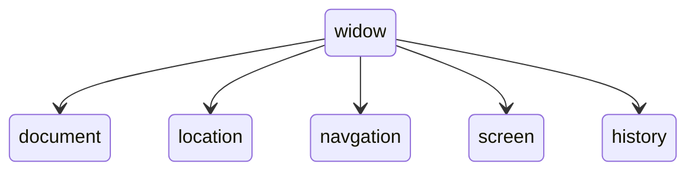

# DOM/BOM

|DOM| BOM |
|-|-|
|文档对象模型| 浏览器对象模型 |
|DOM就是把[文档]当做一个[对象」来看待| 把[浏览器]当做一个[对象」来看待 |
|DOM的顶级对象是document| BOM的顶级对象是window |
|DOM主要学习的是操作页面元素| BOM学习的是浏览器窗口交互的一些对象 |
|D0M是W3C标准规范| BOM是浏览器厂商在各自浏览器上定义的，兼容性较差 |

BOM包含DOM



## DOM

什么是DOM

文档对象模型（Document Object Model）

### 1.获取元素

### 2.事件基础

### 3.操作元素

### 4.节点操作

## BOM

什么是BOM

浏览器对象模型（Browser Object Model），与浏览器窗口进行交互的对象

### window对象的常见事件

1. 它是J5访问浏览器窗口的一个接口。
2. 它是一个全局对象。定义在全局作用域中的变量、函数都会变成window对象的属性和方法。
3. 在调用的时候可以省略window，前面学习的对话框都属于window对象方法，如alert0、prompt0等。
   注意：window下的一个特殊属性window.name

#### 窗口加载事件onload

```
window.onload=function(){}
或者
window.addEventListene("load"，function(){})
```

window.onload是窗口（页面）加载事件，当文档内容完全加载完成会触发该事件（包括图像、脚本文件、CSS文件等），就调用的处理函数。

注意：
1.有了window.onload就可以把JS代码写到页面元素的上方，因为onload是等页面内容全部加载完毕，再去执行处理函数。
2.window.onload传统注册事件方式**只能写一次**，如果有多个，会以最后一个window.onload为准。
3.如果使用addEventListener 则没有限制

document.addEventListener（'DOMContentLoaded'，function（）{}）
DOMContentLoaded 事件触发时，仅当DOM载完成，不包括样式表，图片，flash等等。
le9以上才支持
如果页面的图片很多的话，从用户访问到onloacd触发可能需要较长的时间，交互效果就不能实现，必然影响用户的体验，此时用DOMContentLoaded事件比较合适。

#### 调整窗口大小事件

```
window.onresize=function(){}
window.addEventListener("resize",function(){});
```

window.onresize是调整窗口大小加载事件，当触发时就调用的处理函数。

注意：
1.只要窗口大小发生像素变化，就会触发这个事件。
2.我们经常利用这个事件完成响应式布局。window.innerWidth当前屏幕的宽度

### 定时器

setTimeout()方法用于设置一个定时器，该定时器在定时器到期后执行调用函数。

setlnterval()方法重复调用一个函数，每隔这个时间，就去调用一次回调函数。

第一次执行的时候会有时间空白，可以先执行一次这个函数

#### this(谁调用指向谁)

this的指向在函数定义的时候是确定不了的，只有函执行的时候才能确定this到底指向谁，一般情兄下this的最终指向的是那个**调用它的对象**
现阶段，我们先了解一下几个this指向
1.全局作用域或者普通函数中this指向全局对象window（注意定时器setTimeout，setInterval里面的this指向window）


### JS执行机制

#### JS是单线程

JavaScript语言的一大特点就是单线程，也就是说，同一个时间只能做一件事。这是因为Javascript这门脚本语言诞生的使命所致—JavaScript是为处理页面中用户的交互，以及操作DOM而诞生的。比如我们对某个DOM元素进行添加和删除操作，不能同时进行。应该先进行添加，之后再删除。

单线程就意味着，所有任务需要排队，前一个任务结束，才会执行后一个任务。这样所导致的问题是：如果JS执行的时间过长，这样就会造成页面的渲染不连贯，导致页面渲染加载阻塞的感觉。

#### 同步和异步

为了解决这个问题，利用多核CPU的计算能力，HTML5提出Web Worker标准，允许JavaScript脚本创建多个线程。于是，JS中出现了同步和异步。

同步：

前一个任务结束后再执行后一个任务，程序的执行顺序与任务的排列顺序是一致的、同步的。比如做饭的同步做法：我们要烧水煮饭，等水开了（10分钟之后），再去切菜，炒菜。

异步
你在做一件事情时，因为这件事情会花费很长时间，在做这件事的同时，你还可以去处理其他事情。比如做饭的异步做法，我们在烧水的同时，利用这10分钟，去切菜，炒菜。

同步任务
同步任务都在主线程上执行，形成一个**执行栈**。

异步任务
JS的异步是通过**回调函数**实现的。一般而言，异步任务有以下三种类型

1、普通事件，如click、resize等

2、资源加载，如load、error等

3、定时器，包括setinterval、setTimeout等

执行机制

1.先执行**执行栈**中的同步任务。
2.异步任务（回调函数）放入**任务队列**中。
3.一旦执行栈中的所有同步任务执行完毕，系统就会按次序读取任务队列中的异步任务，于是被读取的异步任务结束等待状态，进入执行钱，开始执行。

由于主线程不断的重复获得任务、执行任务、再获取任务、再执行，所以这种机制被称为**事件循环**（eventloop）。

### location 对象

window对象给我们提供了一个**location属性**用于**获取或设置窗体的URL**，并且可以用于**解析URL**。因为这个属性返回的是一个对象，所以我们将这个属性也称为**location对象**。

location属性

| location对象属性 | 返回值 |
| - | - |
|**location.href** | 获取或者设置整个URL|
|location.host | 返回主机（域名）wwwitheima.com|
|location.port | 返回端口号如果未写返回空字符串|
|location.pathname | 返回路径|
|**location.search** | 返回参数|
|location.hash | 返回片段#后面内容常见于链接锚点|

location方法

| location对象方法 | 返回值 |
| ---------------- | ------ |
| location.assign() | 跟href一样，可以跳转页面（也称为重定向页面）|
| location.replace() | 替换当前页面，因为不记录历史，所以不能后退页面|
| location.reload() | 重新加载页面，相当于刷新按钮或者f5如果参数为true 强制刷新ctrl+f5|

### navigator对象

navigator对象包含有关**浏览器的信息**，它有很多属性，我们最常用的是userAgent，该属性可以返回由客户机发送服务器的user-agent头部的值。
下面前端代码可以**判断用户哪个终端**打开页面，实现跳转

```
if((navigator.userAgent.match(/(phone|pad| pod|iphone|ipod|ios|ipad|Android|
)/i)){
window.1ocation.href="";//手机
]else{
window.1ocation.href="";//电脑
```


### history对象

window对象给我们提供了一个history对象，与浏览器历史记录进行交互。该对象包含用户（在浏览器窗口中）访问过的URL。

| history | 对象方法作用 |
| ------- | ------------ |
| back() |  可以后退功能|
|  forward() |  前进功能 |
| go(参数) |  前进后退功能参数如果是1前进1个页面如果是-1后退1个页面|